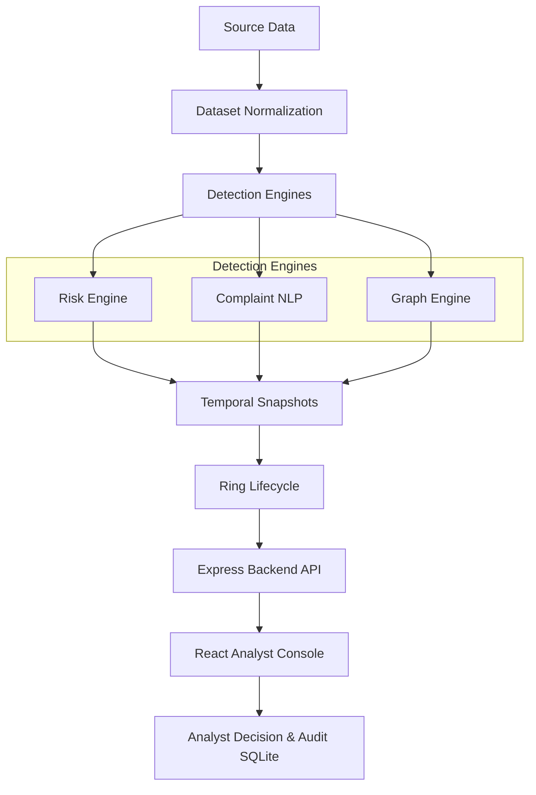

[](https://github.com/25032007/Refundguard/actions/workflows/ci.yml)
# RefundGuard

RefundGuard is a deterministic, explainable refund-fraud detection and investigation platform.

## Problem Statement

Refund fraud involves bad actors systematically abusing return policies to obtain refunds while keeping merchandise. E-commerce platforms face millions in losses when actors orchestrate "refund rings"—coordinated networks of accounts sharing devices, IPs, and methodologies to scale abuse.

## Why Refund Fraud is Difficult

Refund fraud is exceptionally difficult to detect because it blends into legitimate consumer behavior. Fraudsters spread activity across multiple synthetic accounts, use varied refund reasons ("item damaged", "never arrived"), and deliberately operate under threshold limits. Single-account velocity checks are insufficient, and black-box ML models often flag legitimate customers without providing actionable evidence for an analyst to defend a denial.

## Solution Overview

RefundGuard provides a deterministic, multi-layered detection pipeline designed specifically for human-in-the-loop fraud analysis. It unifies behavioral risk scoring, complaint text analysis, and graph-based relationship intelligence to surface coordinated refund rings. Crucially, the system is 100% explainable: every risk score is decomposable into explicit signals backed by traceable evidence.

## Key Features

- **Explainable Customer Risk Scoring**: Six explicit, weighted behavioral signals.
- **Complaint NLP**: Deterministic text normalization, lexical similarity, and reused wording detection.
- **Graph Ring Detection**: Relationship intelligence linking customers via shared devices and IPs.
- **Temporal Analysis**: Analyzes risk across observed historical snapshots.
- **Ring Lifecycle Tracking**: Tracks ring state transitions (EMERGING, ACTIVE, DORMANT, DISBANDED).
- **Emerging Ring Detection**: Identifies new rings forming in historical snapshots.
- **Analyst Console**: React/Vite dashboard for case triage and investigation.
- **Analyst Decision & Audit History**: SQLite-backed persistence for investigation outcomes (UNREVIEWED, MONITOR, ESCALATED, CLEARED).
- **Evaluation Benchmark**: Deterministic historical evaluation dataset.

## Architecture



## Detection Pipeline

RefundGuard analyzes transaction data across three complementary engines:

1. **Risk Engine**: Customer-level behavioral scoring based on refund frequency, rate, velocity, and reason repetition.
2. **Complaint NLP**: Analyzes the lexical content of refund justifications to identify coordinated scripts.
3. **Graph Engine**: Builds a heterogeneous entity graph to detect shared infrastructure (IPs, Devices) among customers.

## Explainability Model

RefundGuard is a decision-support system, not a black box. Every risk decision is supported by deterministic signals and evidence. There are no opaque ML models or LLMs involved. An analyst can view exactly which transactions, devices, or complaint templates contributed to a specific score.

## Risk Scoring Overview

The Risk Engine scores customers based on six implemented signals:

- **Refund Frequency**: Total count of refunds.
- **Refund Rate**: Ratio of refunds to total completed transactions.
- **Refund Velocity**: Concentration of refunds within a specific time window.
- **Repeated Reason**: High percentage of refunds utilizing the same reason code.
- **Shared IP**: Refund accounts sharing an IP address.
- **Shared Device**: Refund accounts utilizing the same device footprint.

Each signal contributes deterministically to a bounded 0-100 risk score.

## Complaint NLP

Complaint analysis is purely deterministic. It utilizes:
- **Text Normalization**: Lowercasing, punctuation removal, and stop-word filtering.
- **Lexical Similarity**: Jaccard similarity over normalized tokens to find near-duplicate narratives.
- **Reused Templates**: Identifies repeatedly reused wording templates across different customers.
- **Evidence Extraction**: Deterministically extracts phrases related to refund reasons (e.g., "damaged", "never arrived").

## Graph/Ring Detection

The graph engine constructs relationships based on:
- Customer to Transaction edges.
- Transaction to shared Device edges.
- Customer to shared IP edges.

Candidate rings are formed by finding connected components of customers sharing resources. Rings are scored deterministically based on member count, density, and shared resource evidence.

## Temporal Analysis

Temporal analysis generates deterministic historical snapshots across specified chronological boundaries. It calculates risk and graph relationships as they existed at specific observed transaction dates. It strictly uses deterministic bounded snapshot selection without look-ahead leakage.

*Note: An observed historical snapshot represents the state of the data at that time; it does not claim to know the exact real-world fraud start time.*

## Ring Lifecycle

Rings identified across temporal snapshots are assigned stable IDs and tracked.
**EMERGING, ACTIVE, DORMANT, and DISBANDED** represent deterministic lifecycle states inferred from observed historical snapshots based on activity and member growth.

## Emerging Ring Detection

RefundGuard detects and tracks emerging refund-ring patterns across deterministic historical snapshots derived from observed transaction activity. It compares consecutive snapshots to identify rings that have just formed or resumed activity.

## Analyst Workflow

The platform supports a complete investigation lifecycle:

1. **Detection**: System flags high-risk accounts.
2. **Case Triage**: Analyst views the dashboard to prioritize cases.
3. **Investigation**: Analyst reviews the customer's behavioral score.
4. **Evidence Review**: Analyst inspects related transactions and complaint similarities.
5. **Ring Investigation**: Analyst explores the interactive refund-ring network graph.
6. **Analyst Decision**: Analyst marks the case as UNREVIEWED, MONITOR, ESCALATED, or CLEARED.
7. **Audit History**: All decisions and version history are persisted in the SQLite database.

## API Overview

The Express backend provides a RESTful API:
- `GET /api/v1/summary`: System overview metrics.
- `GET /api/v1/investigations`: Paginated list of flagged customers.
- `GET /api/v1/investigations/:id`: Detailed evidence for a single customer.
- `PUT /api/v1/investigations/:id/decision`: Submit an analyst decision.
- `GET /api/v1/rings/:ringId/lifecycle`: Retrieve temporal lifecycle history for a ring.

## Dataset/Benchmark Methodology

RefundGuard includes a deterministic legitimate background dataset derived from the **UCI Online Retail II** dataset. Synthetic fields (IPs, devices, complaint text) are deterministically synthesized based on a seed to provide realistic signals without injecting fraud. Specific fraud scenarios (burst refund, slow-burn ring) are deterministically injected for evaluation.

## Evaluation Methodology

The platform is evaluated against deterministic seeded datasets. Ground truth is strictly isolated from the detection engines. The evaluation pipeline computes precision, recall, and PR-AUC using held-out seeds to verify detection performance.

Published results (Phase 3): frozen-config held-out evaluation across seeds 11–30, ring-recovery, lead time, engine ablation, and a ring-escalation experiment are documented in **[docs/EVALUATION.md](docs/EVALUATION.md)** with all raw artifacts under `docs/results/`. Reproduce everything with:

```bash
npm run eval:report        # dev → holdout → unseen → escalation → report (writes docs)
npm run eval:final         # machine-readable final held-out evaluation result
```

## Performance Benchmark

Current validated performance benchmark (Node.js backend, CI fixture):
- **Customers**: 2024
- **Cold build time**: 387 ms
- **P95 List**: 7.68 ms
- **P95 Detail**: 5.62 ms
- **P95 Summary**: 4.89 ms

## Tech Stack

- **Frontend**: React, Vite, React Router, react-force-graph-2d
- **Backend**: Node.js, Express
- **Database**: SQLite (better-sqlite3) for analyst decisions and audit logs
- **Detection Engines**: Vanilla JavaScript (Risk, NLP, Graph, Temporal)

## Project Structure

```text
RefundGuard/
├── backend/
│   ├── services/       # Express API & SQLite persistence
│   └── tests/
├── frontend/           # React + Vite analyst console
├── risk-engine/        # Behavioral risk scoring & temporal analysis
├── nlp/                # Deterministic complaint text analysis
├── graph/              # Ring detection & lifecycle tracking
├── data/               # UCI dataset generation & evaluation fixtures
├── evaluation/         # Performance benchmarking & metrics
├── README.md
└── package.json
```

## Local Setup

### Prerequisites
- Node.js (v22 or later)

### Install
From the repository root:
```bash
npm run setup
```

### Running the project
First, generate the development dataset:
```bash
npm run data:generate
```

Then start the development servers (frontend and backend):
```bash
npm run dev
```
The console will be available at `http://localhost:5173` and the API at `http://localhost:5000`.

## Running on the UCI Benchmark

To run the system on the full synthetic UCI benchmark dataset:

```bash
npm run data:uci
npm run dev:uci
```

To run the full evaluation suite including all UCI-dependent tests:

```bash
npm run test:full
```

### Building
To build the frontend for production:
```bash
npm run build --prefix frontend
```

## Testing

The project has comprehensive test suites. Here are the verified commands and their expected outcomes:

- `npm run test:ci`: Runs the engine, API, frontend, and committed mini-fixture tests (`data/fixtures/mini`) without requiring the UCI dataset.
- `npm run test:full`: Adds the UCI-dependent data and evaluation suites. Generate the benchmark first with `npm run data:uci`.
- `npm run bench:api`: Runs the API performance benchmark (produces the latency stats above).

## Demo & Screenshots

The Analyst Dashboard is available locally at `http://localhost:5173` after running `npm run dev` or `npm run dev:uci`.

## Limitations

- **Deterministic rules over ML**: The system utilizes deterministic rules rather than learned ML models.
- **Benchmark abstraction**: The benchmark dataset and injected scenarios are not equivalent to live production fraud.
- **Emerging definition**: "Emerging" status means the first observable detection in the evaluated historical snapshots, not necessarily the exact moment a criminal intent formed.
- **Performance variation**: Benchmark performance is environment-dependent and not a universal production guarantee.

## Future Improvements

- Production authentication and authorization (SSO/SAML).
- Real-time streaming event ingestion via Kafka.
- Distributed graph processing for datasets exceeding 100,000 nodes.

## License

This project is licensed under the MIT License.