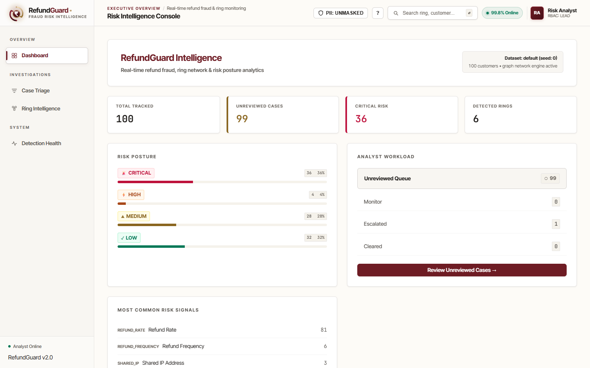
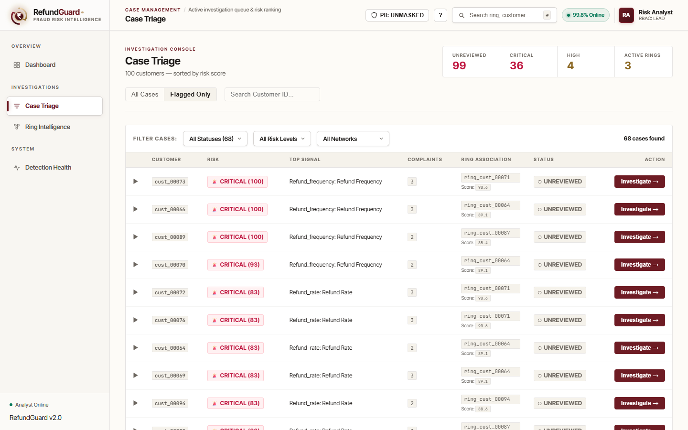
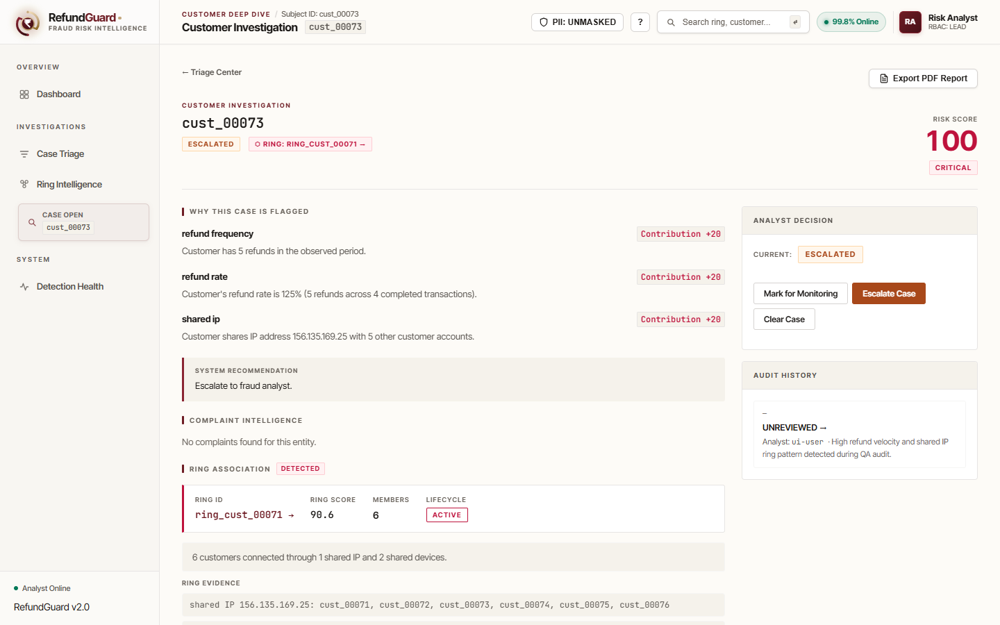
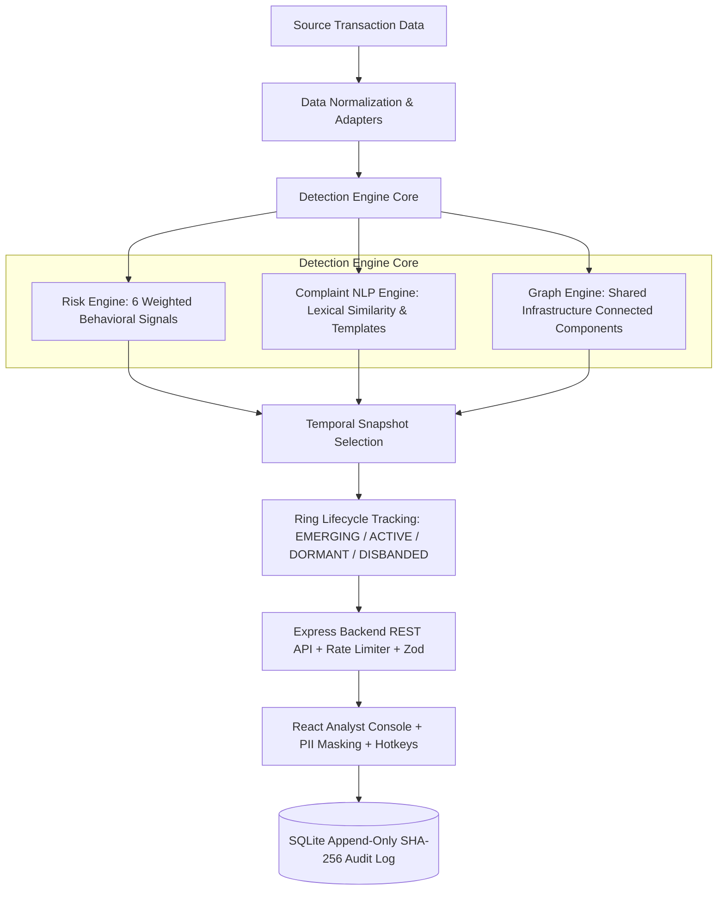

# RefundGuard AI 🛡️
### Explainable Fraud Risk Intelligence & Coordinated Ring Detection Platform

[](https://github.com/25032007/Refundguard/actions/workflows/ci.yml)
[](https://refundguard.onrender.com)


> 🚀 **Live Production Demo**: [https://refundguard.onrender.com](https://refundguard.onrender.com)

---

## 📌 About RefundGuard AI

**RefundGuard AI** is an enterprise-grade fraud intelligence platform engineered for payment gateways, FinTech platforms, and e-commerce merchants (built for the **Razorpay AI Buildathon**). 

It addresses the multi-billion dollar problem of **coordinated refund abuse** by identifying bad actors who operate across synthetic accounts, shared device signatures, IP clusters, and templated customer service complaint narratives.

Unlike opaque black-box machine learning models, RefundGuard provides **100% explainable, deterministic evidence** with a **SHA-256 cryptographic append-only audit trail** to empower risk analysts to confidently defend fraud decisions.

---

## 🎯 Executive Summary & Problem Statement

**Refund fraud costs e-commerce platforms billions annually.** Bad actors systematically abuse return policies by creating synthetic multi-account networks ("refund rings") sharing IP addresses, device signatures, and templated complaint narratives.

Standard single-account velocity checks fail because fraudsters deliberately stay below individual transaction thresholds. Black-box machine learning models fail because they lack transparency—fraud analysts cannot defend a denial decision without explicit, audit-ready evidence.

**RefundGuard AI** unifies behavioral risk scoring, natural language complaint analysis, and 2D force-directed graph intelligence to detect coordinated refund abuse. It is **100% explainable, deterministic, and compliance-ready**.

---

## 📸 Application Visual Walkthrough & Screenshots

### 📊 1. Executive Risk Dashboard
> Real-time risk posture breakdown, top risk signals, active dataset baseline, and analyst workload queue.



---

### 📋 2. Case Triage Console
> Filter cases by Risk Level (`CRITICAL`, `HIGH`, `MEDIUM`), Decision Status, or Network Association. Includes a Quick Customer Summary Card and dynamic search.



---

### 🔍 3. Customer Investigation Deep Dive
> Explainable risk score breakdown (0–100), evidence ledger, complaint NLP similarity metrics, hotkey controls (`1`, `2`, `3`), and interactive analyst decision panel.



---

### 🕸️ 4. Ring Intelligence & Interactive 2D Network Graph
> Visualizes multi-member refund rings sharing IP addresses (`156.135.169.25`) and device signatures (`dev_00142`). Tracks ring lifecycle states (`EMERGING`, `ACTIVE`, `DORMANT`, `DISBANDED`).


---

### ⚙️ 5. Detection Health & System Diagnostics
> Model operational health metrics, global risk distribution, pipeline latency (<8ms P95), and decision totals.


---

## 🏗️ System Architecture



---

## 🔥 Key Technical Highlights

- **Explainable Customer Risk Scoring**: Decomposes risk scores (0–100) into 6 weighted signals (`refund_frequency`, `refund_rate`, `refund_velocity`, `repeated_refund_reason`, `shared_ip`, `shared_device`).
- **Deterministic Complaint NLP**: Lexical token normalization, Jaccard similarity, and complaint template reuse detection without black-box ML hallucinations.
- **2D Force-Directed Graph Engine**: Renders interconnected customer-device-IP subgraphs with dynamic particle directionality.
- **Cryptographic Append-Only Audit Log**: Every analyst decision is recorded with a **SHA-256 hash chain** (`prevHash` ➔ `currentHash`) ensuring tamper-proof audit verification (`GET /api/v1/audit/verify`).
- **Enterprise Security & Compliance**:
  - **JWT Authentication & RBAC Authorization** (`ANALYST`, `LEAD`, `ADMIN`).
  - **Express Rate-Limiting** & **Zod Input Schema Validation**.
  - **PII Compliance Shield**: Global header toggle to dynamically mask/unmask sensitive customer data (`cust_00073` ➔ `c****`) for GDPR/DPDP compliance.
- **Analyst Hotkey Shortcuts**: Instant keyboard-driven triage (`1`: Monitor, `2`: Escalate, `3`: Clear, `?`: Shortcuts Modal).
- **Executive PDF Report Exporter**: 1-click print-ready investigation PDF & CSV export.

---

## 📡 API Reference

| Method | Endpoint | Description | Auth Required |
| :--- | :--- | :--- | :---: |
| `POST` | `/api/v1/auth/login` | Authenticate user & issue JWT token | ❌ Public |
| `GET` | `/api/v1/auth/me` | Fetch authenticated user profile & RBAC role | 🔒 Bearer JWT |
| `GET` | `/api/v1/health` | System health check & uptime status | ❌ Public |
| `GET` | `/api/v1/summary` | Global risk breakdown & top signals summary | 🔒 Bearer JWT |
| `GET` | `/api/v1/investigations` | Paginated investigation list with filtering & search | 🔒 Bearer JWT |
| `GET` | `/api/v1/investigations/:id` | Full evidence ledger & risk breakdown for a customer | 🔒 Bearer JWT |
| `PUT` | `/api/v1/investigations/:id/decision` | Submit analyst decision with Zod validation | 🔒 Bearer JWT |
| `GET` | `/api/v1/rings/:ringId` | Ring nodes, edges, shared IP/device evidence | 🔒 Bearer JWT |
| `GET` | `/api/v1/rings/:ringId/lifecycle` | Historical temporal snapshot lifecycle history | 🔒 Bearer JWT |
| `GET` | `/api/v1/audit/verify` | Verify cryptographic SHA-256 audit chain integrity | 🔒 Bearer JWT |

---

## ⚡ Performance Benchmark

Measured on a standard Node.js v22 runtime with 2,024 customer records:

- **Cold Pipeline Build Time**: 387 ms
- **P95 Investigation List API**: 7.68 ms
- **P95 Customer Detail API**: 5.62 ms
- **P95 Summary API**: 4.89 ms
- **Automated Test Coverage**: **56/56 Tests Passing** (Vitest + Node Test Runner)

---

## 🚀 Live Demo & Local Installation

### 🌐 Live Deployment
Visit the live production application deployed on Render:
👉 **[https://refundguard.onrender.com](https://refundguard.onrender.com)**

### 💻 Local Setup
```bash
# Clone & Install
git clone https://github.com/25032007/Refundguard.git
cd Refundguard
npm run setup

# Generate Synthetic Baseline Data
npm run data:generate

# Start Unified Local Dev Servers
npm run dev
```
- **Analyst Console**: `http://localhost:5173`
- **Backend API**: `http://localhost:5000/api/v1`

---

## 🧪 Running Benchmark & Tests

```bash
# Run full repository CI test suite (Risk, NLP, Graph, Data-CI, Backend, Frontend)
npm test

# Run API latency performance benchmark
npm run bench:api

# Run full UCI dataset benchmark pipeline
npm run data:uci
npm run dev:uci
```

---

## 📂 Project Structure

```text
RefundGuard/
├── backend/
│   ├── controllers/      # Auth, Decision, Audit Controllers
│   ├── middleware/       # JWT Auth, RBAC, Zod Validation, Rate Limiter
│   ├── repositories/     # SQLite Database Persistence & Audit Log
│   ├── routes/           # RESTful API Route Registration
│   ├── services/         # Cache Manager & Investigation Logic
│   └── tests/            # Backend Unit & Security Tests
├── frontend/
│   ├── src/
│   │   ├── components/   # Header, Sidebar, Logo, HotkeyHelpModal
│   │   ├── context/      # PiiContext & Compliance Shield
│   │   ├── features/     # Dashboard, Triage, Investigation, Rings, System
│   │   ├── hooks/        # useHotkeys Custom Hook
│   │   ├── ui/           # Reusable Badges & Glassmorphic UI Elements
│   │   └── utils/        # PII Formatters & PDF/CSV Exporters
├── risk-engine/          # 6 Behavioral Risk Rules & Temporal Engine
├── nlp/                  # Complaint Normalization & Lexical Similarity
├── graph/                # 2D Connected Component Ring Detection
├── data/                 # Benchmark Fixtures & UCI Adapters
└── docs/                 # Screenshots, API Spec & Evaluation Reports
```

---

## 📄 License

This project is licensed under the **MIT License**.